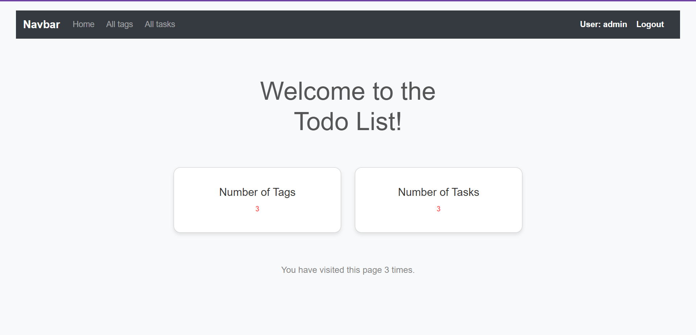

# todo_list

Django project for managing tasks and tags

## Installation

Python3 must be already installed

```shell
git clone https://github.com/volodymyr-komarnyckyi/todo_list
cd todo_list
python -m venv venv
venv\Scripts\activate (on Windows)
source venv/bin/activate (on macOS)
pip install -r requirements.txt
python manage.py runserver #starts Django Server
```


## Default user for website

```
username: admin
password: Volodymyr8204
```

## Demo




